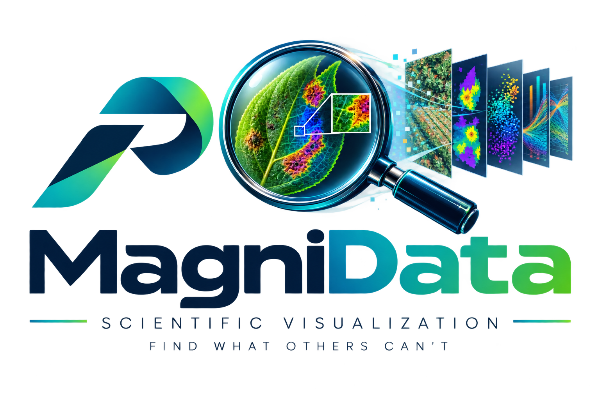

<p align="center">
  
</p>

# MagniData

[](LICENSE.md)
[](https://pypi.org/project/magnidata/)
[](https://pypi.org/project/magnidata/)

---

An interactive visual-query dashboard for exploring image datasets: a deterministic
feature-extraction pipeline, a Flask API, and a React/Three.js dashboard for browsing
images, segmentation masks, and embeddings — including a live 3D PCA/t-SNE/cluster
view over a dataset's embedding space.

- **`precisionai/magnidata/tools/`** — a domain-agnostic feature extractor: turns a folder of
  images (optionally with COCO-format segmentation annotations) into a single CSV of
  per-image complexity/quality/coverage metrics, plus an optional embeddings generator
  (DINOv2 by default) producing a matching JSON.
- **`precisionai/magnidata/api/`** — a Flask API serving images/masks/overlays, dataset
  listing and CSV/embeddings access, server-side PCA/t-SNE/LLE projection and clustering
  over embeddings, and an in-app dataset-build pipeline (upload your own images, or
  one-click "demo" builds of COCO128 / AgriStress-500).
- **`precisionai/magnidata/dashboard/`** — the React + Vite + Three.js portal: parallel
  coordinates, histograms, a data table, an image/mask/overlay preview, and the 3D
  embeddings view.

Coding standards, naming conventions, and tooling configuration for the Python side are
governed by [CLAUDE.md](CLAUDE.md). This repository was migrated from an existing,
working application rather than started from a blank template — see
[CONTRIBUTING.md](CONTRIBUTING.md#known-gaps) for the specific places it doesn't yet meet
every standard there.

---

## Quickstart — run the full stack

```bash
git clone git@github.com:Precision-AI-Inc/magnidata.git
cd magnidata
docker compose up --build
#   portal -> http://localhost:5175
#   api    -> http://localhost:5051/api/health
```

The dataset catalog (`precisionai/magnidata/confi.yaml`) ships empty. From the portal's
"Bring Your Own Data" dialog, either prepare a self-contained demo (COCO128 or
AgriStress-500 — no external data required), build from a folder you've placed in
`./image_sets` (read in place — no upload and no size cap), or upload your own images. See
[`precisionai/magnidata/README.md`](precisionai/magnidata/README.md) for the full breakdown
of the app's layout, data mounts, and how to register a permanent catalog entry.
Docker accepts BYOD image/annotation uploads up to 16 GiB by default, plus a 100 MB
embeddings JSON. For larger uploads, raise both the API service's
`DATASET_BUILD_MAX_TOTAL_BYTES` and `dashboard/nginx.conf`'s `client_max_body_size` — or
use the `./image_sets` route, which bypasses the upload entirely.

---

## Installation (Python package only)

```bash
python -m venv .venv
source .venv/bin/activate

# API + feature-extraction toolkit
pip install -e .

# + offline embeddings generation and learned image-quality scoring (torch/timm/pyiqa)
pip install -e ".[ml]"

# Full development install (tests, pre-commit, type checking)
pip install -e ".[dev]"
pre-commit install
```

The dashboard is a separate Node/Vite app (Node 18+) — see
[`precisionai/magnidata/dashboard`](precisionai/magnidata/dashboard):

```bash
cd precisionai/magnidata/dashboard
npm install
npm run dev   # proxies /api to http://localhost:5051 by default — see vite.config.ts
```

---

## Running the API server

The primary path is Docker Compose (see Quickstart above). To run it directly instead —
note this must be run **from within `precisionai/magnidata/api/`**, not as an installed
package: its modules use flat, sibling-style imports (`import db`, `import local_files`)
matching how `Dockerfile.api` copies them into the container, so `python -m
precisionai.magnidata.api.app` will not work.

```bash
cd precisionai/magnidata/api
pip install -r requirements.txt
python app.py          # default: host 0.0.0.0, port 5050 (override with API_PORT)
```

`./start.sh` does the same, plus creating/activating a local `.venv` first.

## Feature extraction & embeddings CLI

```bash
python -m precisionai.magnidata.tools.features --input data/mydata.csv --output out.csv
python -m precisionai.magnidata.tools.embeddings --input data/mydata.csv --output data/mydata.json
```

See [`precisionai/magnidata/tools/README.md`](precisionai/magnidata/tools/README.md) for the
full column schema and flags, and
[`precisionai/magnidata/docs/data-contract.md`](precisionai/magnidata/docs/data-contract.md)
for the CSV/embeddings-JSON formats the dashboard consumes — including how to bring your
own data that conforms.
[`precisionai/magnidata/docs/recipes/from-images-to-dashboard.md`](precisionai/magnidata/docs/recipes/from-images-to-dashboard.md)
walks through turning a raw folder of images into a dashboard-ready dataset end to end.

---

## Testing

```bash
python -m pytest                                          # run all tests with coverage report
pytest precisionai/magnidata/tools/test_features.py          # run a specific module
pytest -k "coverage"                                        # run tests matching a keyword
```

Tests are colocated with the module they cover (`precisionai/magnidata/**/test_*.py`), not
under a top-level `tests/` — see [CONTRIBUTING.md](CONTRIBUTING.md#known-gaps). Coverage
is enforced at 60% (measured at 63.2% at migration time), short of the org's 90% target —
also tracked there.

---

## Pre-commit hooks

| Hook | What it checks |
|---|---|
| File hygiene | Large files (> 1800 KB), trailing whitespace, merge conflicts, private keys, debug statements, BOM removal |
| `ruff` | Linting and import sorting (auto-fix) on the files you touch |
| `ruff-format` | Code formatting (auto-fix) |
| `pyright` | Static type checking |
| `pytest` | Full test suite with a coverage floor |

Run all hooks manually without committing:

```bash
pre-commit run --all-files
```

---

## Project layout

```
precisionai/magnidata/
  api/          Flask API — images/masks/overlays, dataset listing, embedding
                projection/clustering, in-app dataset builds
  tools/        Feature extractor (images [+ COCO annotations] -> CSV) and
                embeddings generator (images -> JSON) — see tools/README.md
  scripts/      Standalone dataset-preparation scripts (e.g. the COCO128 demo)
  dashboard/    React + Vite + Three.js portal, served by nginx in Docker
  docs/         data-contract.md and recipes/ — file formats and end-to-end guides
  confi.yaml    Dataset registry (which CSVs the portal lists)
Dockerfile.api, Dockerfile.dashboard, docker-compose.yml   at the repo root
docs/           Sphinx (HTML + LaTeX/PDF) for the Python package
```

See [CLAUDE.md](CLAUDE.md) for the full coding standard covering imports, docstrings, type hints, testing, and what to avoid — and [CONTRIBUTING.md](CONTRIBUTING.md#known-gaps) for where this repo currently deviates from it.

---

## Documentation

```bash
cd docs
make html       # HTML docs → docs/_build/html/index.html
make latexpdf   # PDF      → docs/_build/latex/documentation.pdf
make clean      # Remove build artefacts
```

Dependencies: `pip install -r docs/requirements.txt`

---

## Releasing

Push a tag matching `v*.*.*` (e.g. `v0.1.0`) to trigger `.github/workflows/release.yml`, which runs the test suite, builds the sdist/wheel, publishes to PyPI via trusted publishing, and creates a GitHub Release. The package version is derived from the git tag via `setuptools-scm` — update `CHANGELOG.md` before tagging.

---

## Security

To report a security vulnerability, see [SECURITY.md](SECURITY.md). Do not open a public issue.

---

## Contributing

See [CONTRIBUTING.md](CONTRIBUTING.md) for setup, branching, and PR guidelines, and [CODE_OF_CONDUCT.md](CODE_OF_CONDUCT.md) for community expectations. [CLAUDE.md](CLAUDE.md) documents the code style and conventions this repo targets.

---

## License

[Apache 2.0](LICENSE.md) © Precision AI
