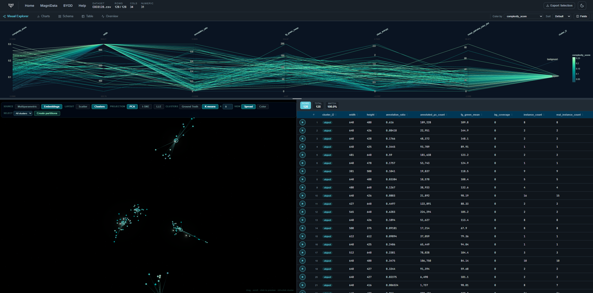

# MagniData: See what others can't

*Precision AI · release note · September 2026*

MagniData is an image-dataset exploration tool for teams that need to understand what
is inside a large visual dataset before they train, label, clean, or ship with it.

It turns images into a dashboard-ready feature table, then makes those features usable
as parallel coordinates, 3D views, histograms, table filters, and image previews.
Parallel coordinates is the main working view: each axis is an extracted signal, and
brushing several axes together becomes a combined feature-extraction query.

Example feature output:

```csv
image_path,annotation_ratio,blur_laplacian,noise_sigma,colorfulness,complexity_score,camera_angle
image_sets/field/images/img_001.jpg,0.421,318.7,4.8,27.1,0.63,oriented
```

## MagniData Dashboard Preview

<p align="center">
  
</p>

## Why it matters

Image datasets are hard to inspect one thumbnail at a time. Quality problems,
annotation gaps, duplicate scenes, capture bias, and hard examples often only appear
when several measurements are viewed together.

MagniData makes that inspection direct. Users can combine interpretable extracted
features such as blur, contrast, exposure, color balance, annotation coverage,
instance count, class mix, and complexity score, then see the matching images
immediately in the 3D view, table, and preview.

## What it unlocks

- Find dataset outliers, low-quality images, and difficult samples faster.
- Use parallel-coordinate brushes as a human-readable feature extraction layer.
- Compare multiparametric features with embedding-space structure.
- Build and save curated subsets for training, review, or downstream analysis.
- Bring your own images, build demo datasets, or load an existing feature CSV.

## Usage

```bash
git clone git@github.com:Precision-AI-Inc/magnidata.git
cd magnidata
docker compose up --build
```

Open the dashboard at `http://localhost:5175`.

From the landing screen, open MagniData and choose a prepared demo, build from a local
folder under `image_sets/`, upload your own images, or load a CSV that already follows
the MagniData data contract.

For feature extraction only:

```bash
python -m precisionai.magnidata.tools.features --input images.csv --output features.csv
```

Minimal requirements: Docker for the full app, or Python for the feature extractor.
Embeddings are optional; when present, they unlock the embedding-space 3D view.

---

*Precision AI · September 2026*
